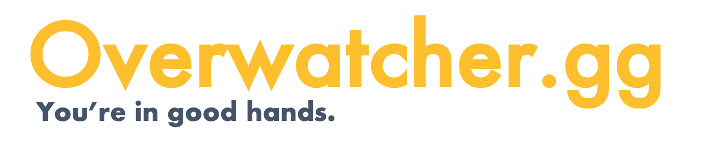
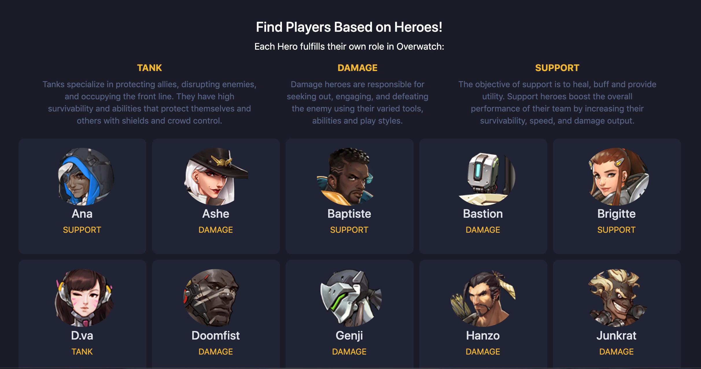
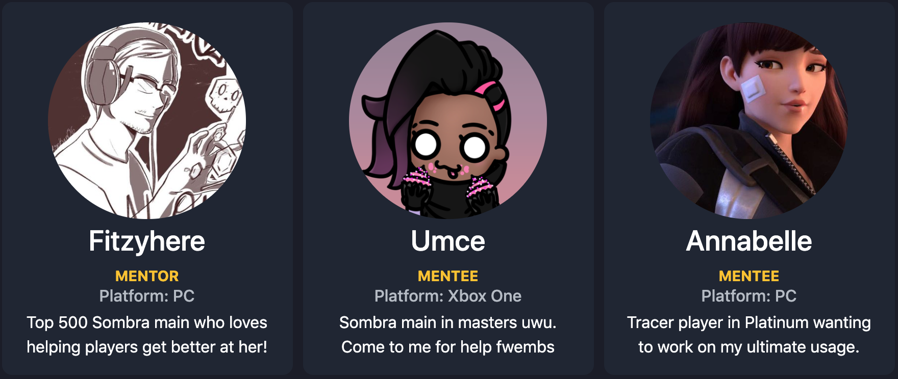
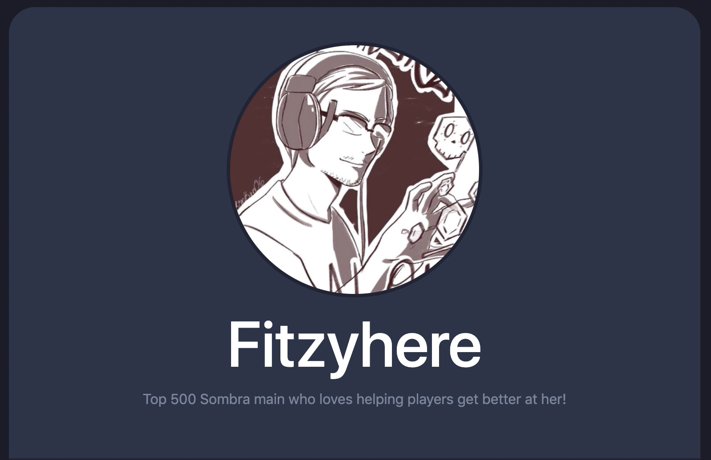
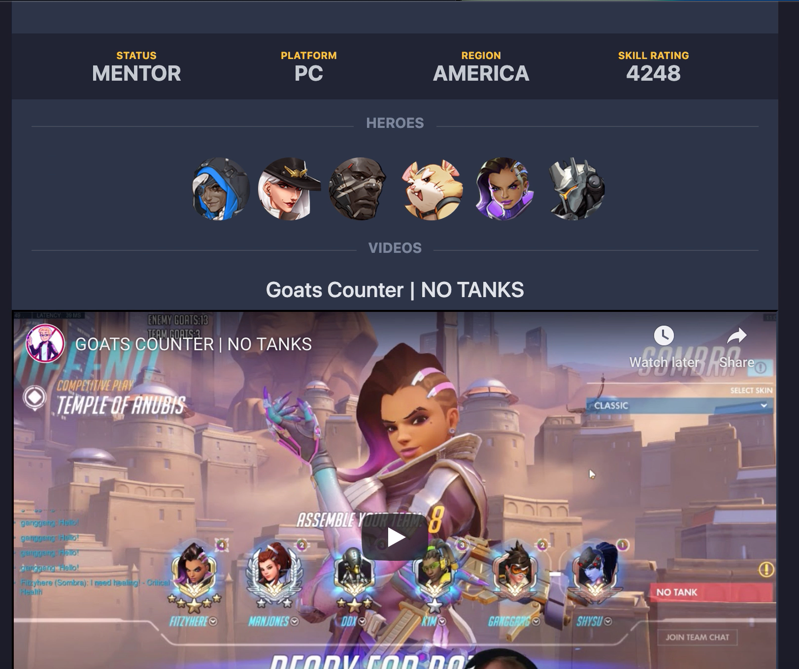
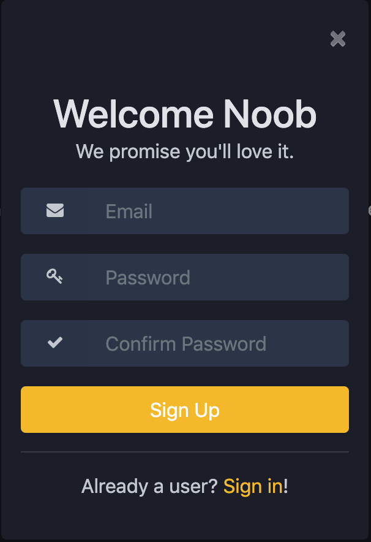
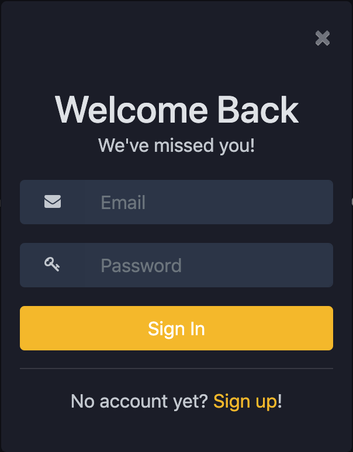

## 📖 About
Overwatcher.gg (Formerly known as Adopt A Player) is a mentoring platform for players to improve their gameplay with the help of highly skilled players. The idea came to fruitiion after noticing a need for stable mentoring programs to complement the rise of esports at the high school and collegiate level. The benefits of esports include but aren't limited to **increased spatial awareness**, **heightened reaction time**, **improved cooperative behavior**, and **improved scholastic aptitude**--thus it was important to create a platfrom to elicit these benefits. As a former assistant Tespa coach and Top 500 Overwatch player, facilitaitng player growth personally and professinoaly became a passion.

Check out the repo for Overwatcher's [Ruby on Rails API](https://github.com/acupoftee/Adopt-A-Player)!

## ✨ Features
* View available mentors and mentees
* Search for players based on heroes played
* Customize profile and VOD showcase as a signed in user

## ✍️ Planning
The design was inspired by [Discord's](https://discord.gg) color scheme as it's the main hub for gamers and nerds alike! This type of design isn't ubiquitous yet, so it was important to still remain inclusive whien designing this. Mobile first design principles were applied first and foremost, and future iterations will continue to prioritize it.

Problem solving strategies involved were first creating a plan on paper, then translating it into psuedocode, and finally coded the solution. The [SEI issue tracker](https://git.generalassemb.ly/ga-wdi-boston/game-project/issues) helped with arriving at solutions with my own approach. Error Driven Development (EDD) and Behavior Driven Development spearheaded the remainder of the process.

### 📚User Stories
As a user:
* I want to make a profile for this website
* I want to display my preferred hereos in Overwatch
* I want to display a summary of my goals for Overwatch
* I want to search for mentees and mentors
* I want to include my Skill Rating
* I want to make a new account for this website
* I want to sign in and save my profile information for this website

### 🖼 Wireframes
To continue practicing mobile first design with Bootstrap with MVP in mind, wireframing was one of the toughest parts of this process. This was especially tough because this needed to appeal to Overwatch's playerbase along with any user viewing this website.

The design needed to be easy on the eyes, responsive, comfortable to use at anytime of the day, and **accessible**. Here are a few iterations incorporating comfortable, responsive design principles:

<h4 align="center">Profile Card Wireframs</h4>

<h4 align="center">Finalized Profile Cards</h4>

<h4 align="center">Login Wireframes</h4>

<h4 align="center">Finalized Login</h4>
 

## 🌱 Challenges + Reflections
The biggest challenges for the client were finding a suitable color palette and designing a responsive layout with Bootstrap. Challenges to anticipate going forward include adding additional features without compromising the responsive design.

The most surprising challenge was adding content for the landing page. Because of the nature of MVP, there wasn't much content to add to the homepage that would sell this website. Building an eyecatching homepage is certainly part of the next iteration.

These challenges made for a fun project experience! This along with the backend challenges happened in the pursuit of knowledge, growing esports, and making a long time idea come to fruition. Perseverance through these challenges were made possible by my devotion to esports.

## Technologies Used
* HTML
* CSS
* SASS
* Bootstrap
* JavaScript
* JQuery
* Ajax

* * *
*Special thanks to my friends/classmates for supporting this idea, coming up with names, and listening to me go on and on about my Overwatch obsession. Very special thanks to my best friend and main Overwatch partner who sacrified her entire day to sit and watch me work on this project.*
